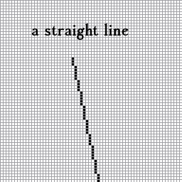
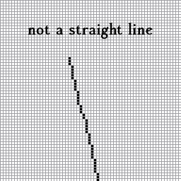

# raster-to-vector
A fast way to convert rasterized straight edges into vectors.

 

If given the pixel pattern data of a line bit by bit, it is possible to determine if a line is straight without using loops or slow calculus functions.

This is implemented in the "rastToVec.c" source code.

In the "tests/line_patt" folder the output of the fast method is tested using the output of a different and more slower method.

Objective: to create code that...
* quickly converts edges into vectors
* is practical and easy to use
* uses a single c source code file

Applications:
* landscaping
* home decorating
* CAD
* augmented reality
* real time 3d modeling of the real world
* camera based collision detection systems

Todo List:
* Write edge tracer code
* Demonstrate raster to vector conversion

You can email me if you find any bugs.
